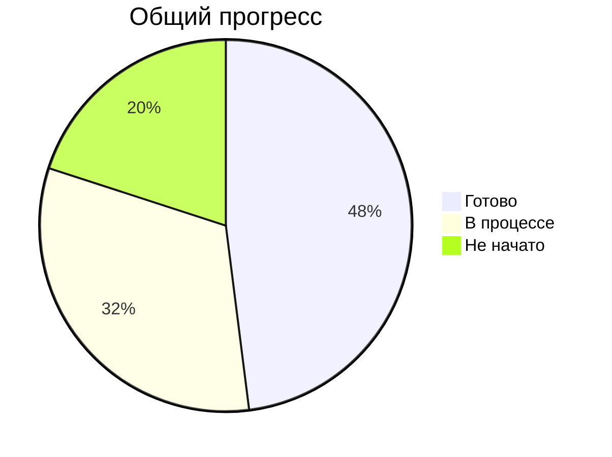

# Чек-лист выполнения задач KarmaBot1

## 📌 Основные компоненты

### 1. Ядро системы
- [x] Базовая архитектура проекта
- [x] Настройка окружения
- [x] Конфигурация базы данных
- [x] Система логирования
- [x] Обработка ошибок

### 2. Пользовательская система
- [x] Регистрация и аутентификация
- [x] Профиль пользователя
  - [x] Баланс баллов лояльности
  - [x] История операций
  - [x] Реферальная статистика
  - [x] QR-коды и скидки (просмотр/валидация)
  - [ ] Настройки профиля

### 3. Система лояльности ✅ Готово
- [x] Начисление баллов
- [x] Списание баллов
- [x] История транзакций
- [x] Правила начисления

### 4. Реферальная программа 🚧 В процессе
- [x] Генерация реферальных ссылок
- [x] Базовая статистика рефералов
- [ ] Обработка регистрации по коду (валидация/начисления)
- [ ] Отчётность и anti‑fraud проверки

### 5. Каталог заведений
- [x] Модели данных
 - [x] Поиск по категориям (фильтры, пагинация 5/стр)
- [ ] Поиск по местоположению
 - [x] Детальная карточка заведения (рендер ℹ️/🗺)
- [ ] Фильтрация и сортировка

### 6. Партнерский кабинет 🚧 В процессе
- [x] Создание карточек заведений (через API)
- [x] Галерея/медиа (загрузка/удаление, лимиты)
- [ ] Регистрация партнеров
- [ ] Управление скидками
- [ ] Статистика посещений

### 7. Админ-панель 🚧 В процессе
- [ ] Управление пользователями
- [x] Модерация контента (очередь, approve/reject)
- [ ] Настройки системы
- [ ] Аналитика и отчеты

### 8. WebApp
- [x] Базовые эндпоинты (health/ready)
- [x] Совместимость /cabinet/* (алиасы в minimal‑mode)
- [ ] Личный кабинет
- [ ] Просмотр каталога
- [ ] QR-сканер
- [ ] Партнерская панель

### 9. Тестирование
- [x] Базовые тесты
- [x] Smoke (партнёрский кабинет/QR)
- [ ] Unit-тесты (расширить)
- [ ] Интеграционные тесты
- [ ] E2E (в процессе)
- [ ] Нагрузочное тестирование

### 10. Деплой и инфраструктура
- [x] Настройка Railway
- [x] Переменные окружения
- [ ] CI/CD пайплайн
- [ ] Мониторинг и логи (Prometheus/Grafana, Sentry)

## 📊 Статус выполнения

## 📅 Ближайшие задачи
1. E2E сценарии (user journey, partner workflow)
2. Завершение реферальной логики и тестов
3. Доработка рендера карточек/UX
4. Отчёты админки + экспорт
5. Мониторинг (метрики/дашборды/алерты)

## 📝 Примечания
- ✅ - Завершено
- 🚧 - В процессе
- ⏳ - Запланировано
- ❌ - Не начато

Последнее обновление: 2025-09-03, 10:00 (VN, UTC+7)
