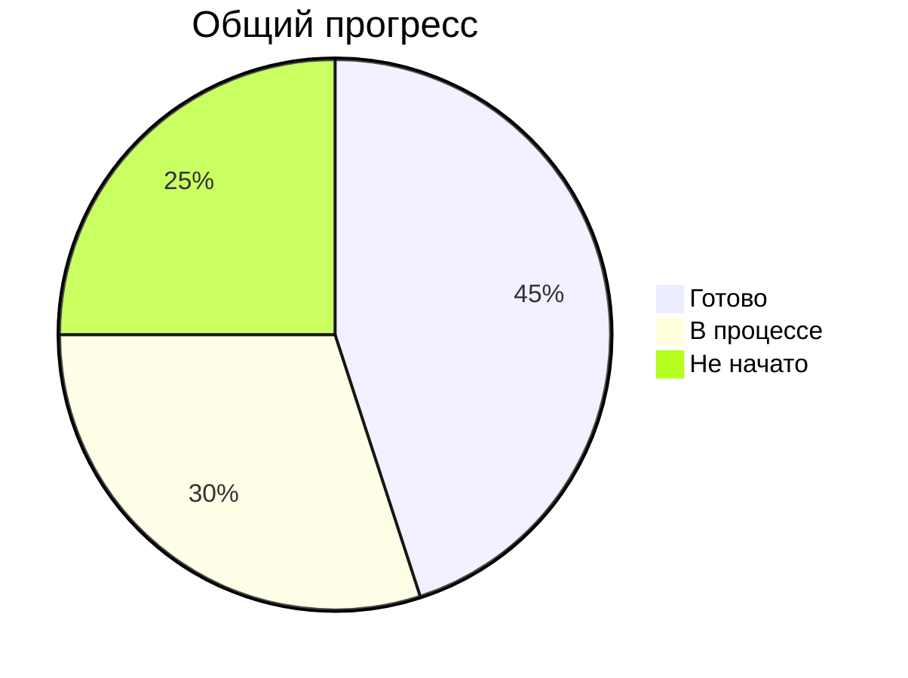

# Чек-лист выполнения задач KarmaBot1

## 📌 Основные компоненты

### 1. Ядро системы
- [x] Базовая архитектура проекта
- [x] Настройка окружения
- [x] Конфигурация базы данных
- [x] Система логирования
- [x] Обработка ошибок

### 2. Пользовательская система
- [x] Регистрация и аутентификация
- [x] Профиль пользователя
  - [x] Баланс баллов лояльности
  - [x] История операций
  - [x] Реферальная статистика
  - [ ] QR-коды и скидки
  - [ ] Настройки профиля

### 3. Система лояльности ✅ Готово
- [x] Начисление баллов
- [x] Списание баллов
- [x] История транзакций
- [x] Правила начисления

### 4. Реферальная программа ✅ Готово
- [x] Многоуровневая реферальная система
- [x] Генерация реферальных ссылок
- [x] Начисление вознаграждений
- [x] Статистика рефералов

### 5. Каталог заведений
- [x] Модели данных
- [ ] Поиск по категориям
- [ ] Поиск по местоположению
- [ ] Детальная карточка заведения
- [ ] Фильтрация и сортировка

### 6. Партнерский кабинет 🚧 В процессе
- [ ] Регистрация партнеров
- [ ] Создание карточек заведений
- [ ] Управление скидками
- [ ] Статистика посещений

### 7. Админ-панель 🚧 В процессе
- [ ] Управление пользователями
- [ ] Модерация контента
- [ ] Настройки системы
- [ ] Аналитика и отчеты

### 8. WebApp
- [ ] Личный кабинет
- [ ] Просмотр каталога
- [ ] QR-сканер
- [ ] Партнерская панель

### 9. Тестирование
- [x] Базовые тесты
- [ ] Unit-тесты
- [ ] Интеграционные тесты
- [ ] Нагрузочное тестирование

### 10. Деплой и инфраструктура
- [x] Настройка Railway
- [x] Переменные окружения
- [ ] CI/CD пайплайн
- [ ] Мониторинг и логи

## 📊 Статус выполнения

## 📅 Ближайшие задачи
1. Завершение работы над личным кабинетом пользователя
2. Реализация WebApp интерфейса
3. Настройка системы модерации
4. Доработка админ-панели
5. Написание тестов

## 📝 Примечания
- ✅ - Завершено
- 🚧 - В процессе
- ⏳ - Запланировано
- ❌ - Не начато

Последнее обновление: 01.09.2025
